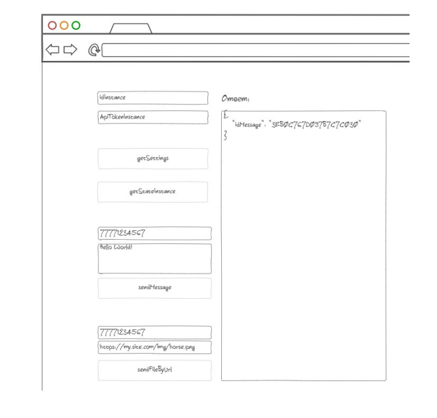

# 📦 Green API Тестовое задание

В рамках выполнения тестового задания необходимо разработать HTML-страницу с методами **GREEN-API**, разместить исходники проекта на GitHub, опубликовать страницу в Интернете и записать короткое видео с демонстрацией работы.

⏳ **Время на выполнение задания:** 3 дня

---

## ✅ Требования

1. Реализовать HTML-страницу с вызовами методов:
   - `getSettings`
   - `getStateInstance`
   - `sendMessage`
   - `sendFileByUrl`
2. Разместить на странице поля для подключения к инстансу:
   - `idInstance`
   - `apiTokenInstance`
3. Выводить ответ методов в отдельное **только для чтения** поле.
4. Визуально придерживаться макета (см. ниже ⬇️).

---

## 🧩 Алгоритм работы

1. Пользователь заходит в личный кабинет [Green-API](https://green-api.com/) и создает новый инстанс на бесплатном аккаунте разработчика.
2. Сканирует QR-код и подключает свой номер телефона.
3. Переходит на HTML-страницу, введёт `idInstance` и `apiTokenInstance`.
4. Нажимает поочерёдно на кнопки:
   - `getSettings`
   - `sendMessage`
5. Видит результат вызова API в блоке ответов, а сообщения успешно отправляются в WhatsApp.

---

## 🎯 Макет интерфейса

---

## 📂 Результат 

[Открыть страницу](http://ec2-16-170-247-31.eu-north-1.compute.amazonaws.com/)
